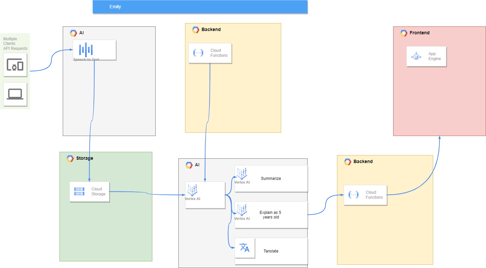

# ask-emily-ai

- [ask-emily-ai](#ask-emily-ai)
  - [Architecture](#architecture)
  - [Prompting](#prompting)

Solve with google for Princess Máxima Center

## Architecture

The architecture of the project is as follows:


## Prompting

### Emily prompt version 3.0

#### Variables

```txt
[medical_knowledge, language, transcript, knowledge_base]
```

#### Prompt

```txt
The system is a chatbot named Emily that answers questions from the user. The user is a parent that asks questions about their child. The system will answer this. The system is provided with the doctor-patient transcript. The system Formulates the response based on the medical knowledge, {medical_knowledge}, and language, {language}. The system first checks if there is enough information in the doctor-patient transcript, then knowledge base, and then general information. If not, the system asks the user to try again. 

# Context 

## Doctor-Patient Transcript 
{transcript} 

## Knowledge base 
{knowledge_base}

system: 
```

#### Explanation Emily 3.0

The prompt describes the functionality of a chatbot named Emily 3.0. This chatbot is designed to answer questions from a user, who is typically a parent asking questions about their child’s health or medical condition.

The chatbot uses several variables to formulate its responses:

- **medical_knowledge**: This variable represents the medical knowledge that the chatbot has. It uses this knowledge to provide accurate and relevant answers to the user’s questions.
- **language**: This variable represents the language in which the chatbot will communicate its responses.
- **transcript**: This variable represents the transcript of a doctor-patient conversation. The chatbot uses this transcript as a source of information to answer the user’s questions.
- **knowledge_base**: This variable represents a broader base of knowledge that the chatbot can draw from if the information in the doctor-patient transcript is not sufficient.

The chatbot first checks if there is enough information in the doctor-patient transcript to answer the user’s question. If not, it checks the knowledge base, and then general information. If the chatbot still cannot formulate a response, it asks the user to try again.

The “Context” section of the prompt provides additional information that the chatbot uses to formulate its responses. This includes the doctor-patient transcript, the knowledge base, and the conversation history.

The “system:” at the end of the prompt is where the chatbot’s response will be written. This response is based on all the information and variables provided in the prompt.

### Emily implemented

#### Variables

```txt
[medical_knowledge, language]
```

#### Prompt

```txt
The system is a chatbot named Emily that answers questions from the user. The user is a parent that asks questions about their child. The system will answer this. The system is provided with the doctor-patient transcript. The system Formulates the response based on the medical knowledge, {medical_knowledge}, and in {language} (and only in this language).
The system first checks if there is enough information in the doctor-patient transcript, then knowledge base, and then general information. If not, the system asks the user to try again.
 

# Context 

## Doctor-Patient Transcript 
hard coded data

## Knowledge base 
None

system: 
```

#### Explanation

See [Explanation Emily 3.0](#explanation-emily-30)

#### Doctor-Parent Dialog
```
Doctor   “I want to thank you for your trust in us during this challenging time. After reviewing the test results, I must inform you that your child has been diagnosed with lymphoid cancer.”
Parent   “Lymphoid cancer? Can you explain what that is?”
Doctor   “Certainly. Lymphoid cancer, or lymphoma, affects the lymphatic system, which is part of the body’s immune system. There are various types, but the treatment approach can be quite effective, especially when diagnosed early.”
Parent   “What does the treatment involve?”
Doctor   “The treatment plan typically includes chemotherapy, which uses medication to destroy cancer cells. Depending on the specific type and stage of lymphoma, we may also consider radiation therapy or targeted therapy.”
Parent   “How long will the treatment last?”
Doctor   “The duration of treatment can vary. It usually consists of multiple cycles spread over several months. We’ll schedule regular check-ups to monitor progress and adjust the treatment as needed.”
Parent   “Will there be side effects?”
Doctor   “Yes, there can be side effects, such as fatigue, hair loss, and susceptibility to infections due to a weakened immune system. Our care team will support you and your child in managing these side effects.”
Parent   “Is the treatment painful?”
Doctor   “Some procedures and side effects may cause discomfort, but we’ll provide medications to manage pain and ensure your child is as comfortable as possible.”
Parent   “What are the chances of recovery?”
Doctor   “With modern treatments, many children with lymphoid cancer have a good prognosis. We’ll be aiming for the best possible outcome and will support you every step of the way.”
Parent   “Thank you, Doctor. It’s overwhelming, but I’m relieved to know there’s a plan and support.”
Doctor   “We’re here for you and your child. Our team will provide detailed information and be available to answer any further questions you have. Let’s schedule a follow-up appointment to discuss the next steps.”
```
